# BD1B_2S2025_202300644


# Pasos para el despliegue de el contenedor

## Para desplegar el contenedor con docker compose solo necesitaremos usar el siguiente comando:

### 1. docker compose up -d --build
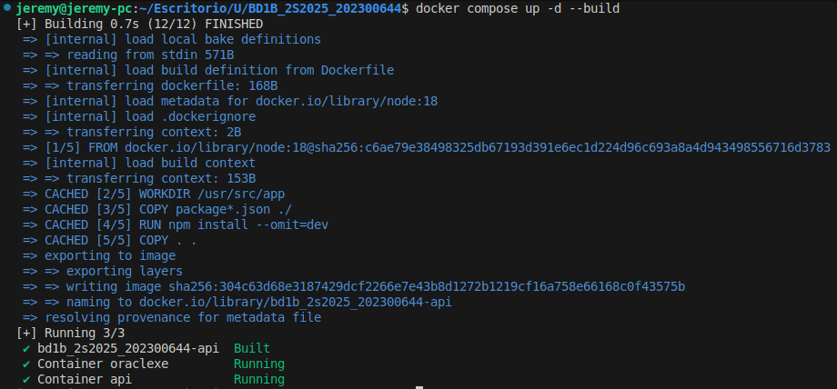

## Guia para conectarse a Dbeaver

### 1. Primero necesitaremos crear una nueva conexion con este boton

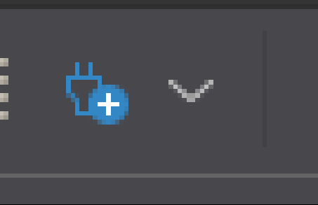

### 2. Despues nos aparece la siguiente interfaz 

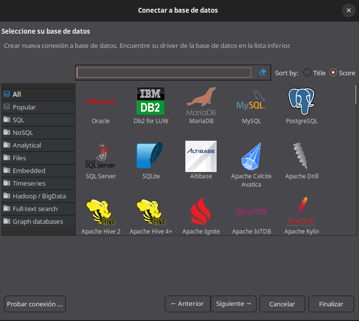

### 3. Seleccionaremos "Oracle" para nuestra nueva conexion y nos mostrara la siguiente interfaz

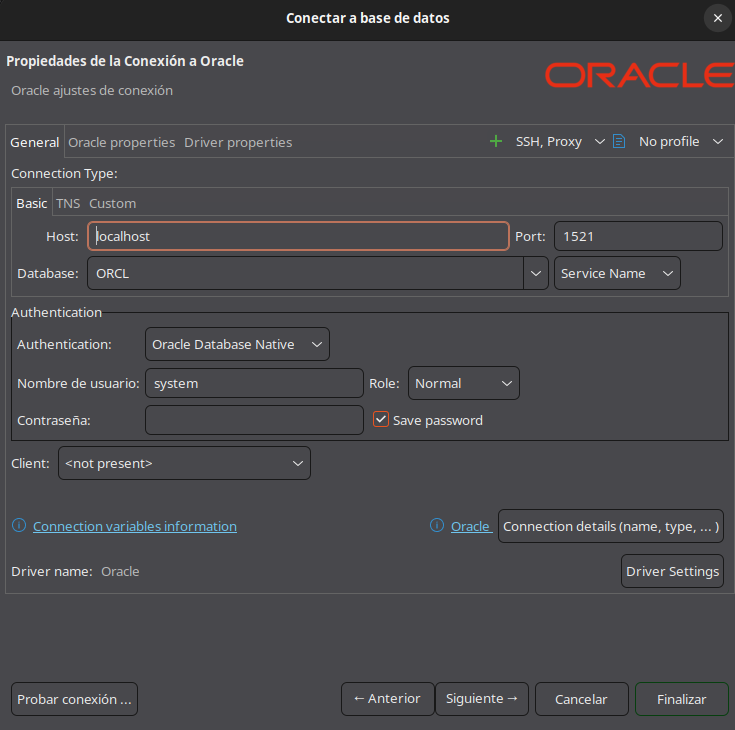


### 4. Para lograr pondremos el usuario creado en el .yml

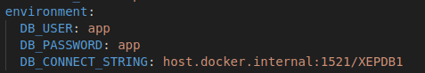


### 5. Colocamos los datos en su respectivo lugar

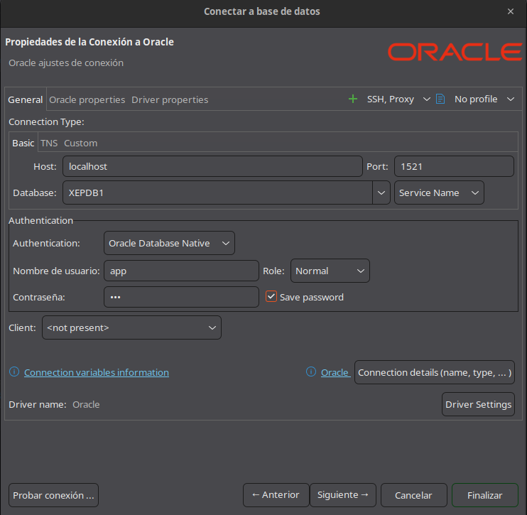

### 6. Presionamos probar conexion para ver si tuvo exito la nueva conexion

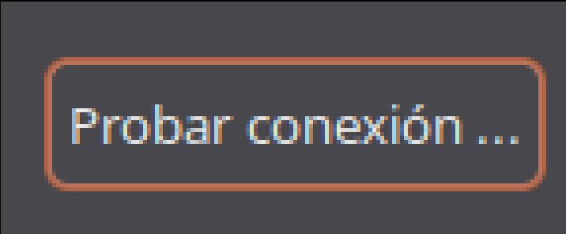

### 7. Aparecera un mensaje de exito de conexion que confirmara que se creo correctamente la nueva conexion

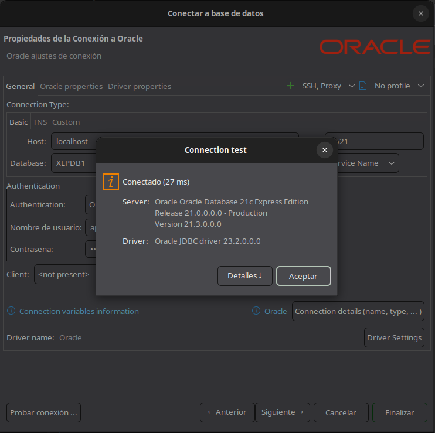

### 8. Despues podemos verificar que todas las tablas se muestran en la nueva conexion

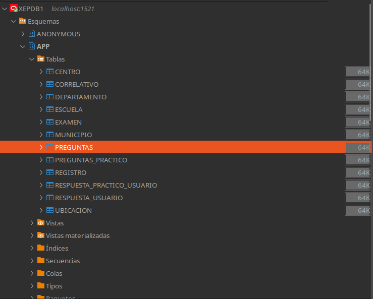

## Uso de Endpoins

### Se usaron 5 tipos de endpoints para las 12 tablas que son los siguientes

#### 1. Ver todos: 
Este endpoint se utiliza para ver todos los registro de la tabla

ejemplo para la tabla centro:

```
app.get('/centros', async (_, res) => {
  let c; try {
    c = await oracledb.getConnection(dbConfig);
    const r = await c.execute(`SELECT ID_CENTRO, NOMBRE FROM CENTRO ORDER BY ID_CENTRO`);
    res.json(r.rows.map(([ID_CENTRO, NOMBRE]) => ({ ID_CENTRO, NOMBRE })));
  } catch (e) { res.status(500).json({ error: e.message }); } finally { if (c) await c.close(); }
});
```

ejemplo en postman sobre la peticion:
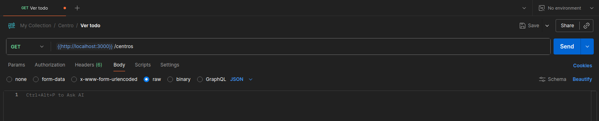

#### 2. Ver por ID: 
Este endpoint se utiliza para ver un registro especifico por medio de su ID

ejemplo para la tabla centro:

```
app.get('/centros/:id', async (req, res) => {
  let c; try {
    c = await oracledb.getConnection(dbConfig);
    const r = await c.execute(`SELECT ID_CENTRO, NOMBRE FROM CENTRO WHERE ID_CENTRO = :id`, [req.params.id]);
    if (!r.rows.length) return res.status(404).json({ error: 'No encontrado' });
    const [ID_CENTRO, NOMBRE] = r.rows[0];
    res.json({ ID_CENTRO, NOMBRE });
  } catch (e) { res.status(500).json({ error: e.message }); } finally { if (c) await c.close(); }
});
```

ejemplo en postman sobre la peticion:
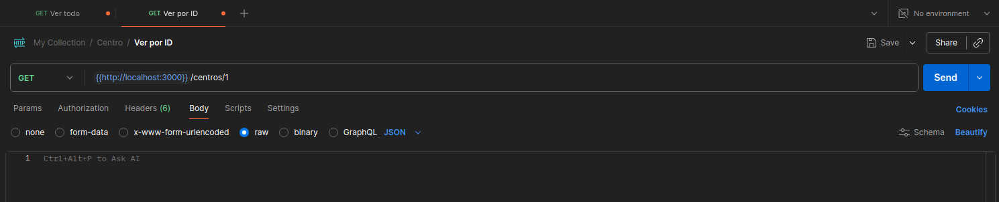

#### 3. Creacion: 
Este endpoint se utiliza para crear un nuevo registro en la tabla

ejemplo para la tabla centro:

```
app.post('/centros', async (req, res) => {
  // defensiva por si el body no llega
  const { ID_CENTRO, NOMBRE } = req.body || {};
  if (ID_CENTRO == null || !NOMBRE) {
    return res.status(400).json({ error: 'ID_CENTRO y NOMBRE son requeridos' });
  }
  let c;
  try {
    c = await oracledb.getConnection(dbConfig);
    await c.execute(
      'INSERT INTO CENTRO (ID_CENTRO, NOMBRE) VALUES (:id, :nombre)',
      { id: ID_CENTRO, nombre: NOMBRE },
      { autoCommit: true }
    );
    res.status(201).json({ ok: true });
  } catch (e) {
    console.error(e);
    res.status(500).json({ error: e.message });
  } finally {
    if (c) await c.close();
  }
});
```

ejemplo en postman sobre la peticion:
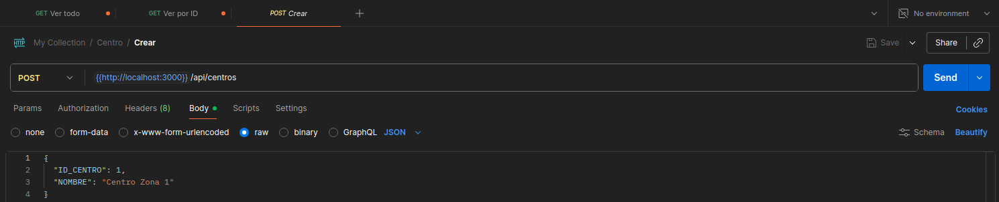

#### 4. Eliminar: 
Este endpoint se utiliza para eliminar un registro de una tabla por medio de su ID

ejemplo para la tabla centro:

```
app.delete('/centros/:id', async (req, res) => {
  let c; try {
    c = await oracledb.getConnection(dbConfig);
    const r = await c.execute(`DELETE FROM CENTRO WHERE ID_CENTRO = :id`, [req.params.id], { autoCommit: true });
    if (r.rowsAffected === 0) return res.status(404).json({ error: 'No encontrado' });
    res.json({ ok: true });
  } catch (e) { res.status(500).json({ error: e.message }); } finally { if (c) await c.close(); }
});
```

ejemplo en postman sobre la peticion:
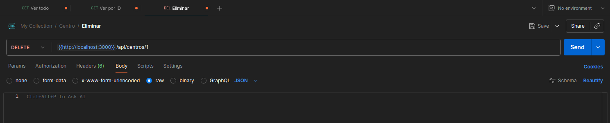

#### 5. Actualizar: 
Este endpoint se utiliza para actualizar un registro de una tabla por medio de su ID

ejemplo para la tabla centro:

```
app.put('/centros/:id', async (req, res) => {
  const { NOMBRE } = req.body;
  if (!NOMBRE) return res.status(400).json({ error: 'NOMBRE requerido' });
  let c; try {
    c = await oracledb.getConnection(dbConfig);
    const r = await c.execute(`UPDATE CENTRO SET NOMBRE = :nombre WHERE ID_CENTRO = :id`, { nombre: NOMBRE, id: req.params.id }, { autoCommit: true });
    if (r.rowsAffected === 0) return res.status(404).json({ error: 'No encontrado' });
    res.json({ ok: true });
  } catch (e) { res.status(500).json({ error: e.message }); } finally { if (c) await c.close(); }
});
```

ejemplo en postman sobre la peticion:
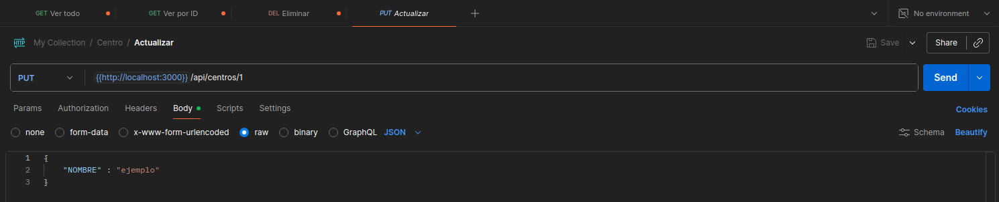

### Endpoints extras

#### Ping
Este endpoint nos ayuda a verificar el estado de la api
```
app.get('/ping', async (_req, res) => {
  let conn;
  try {
    conn = await oracledb.getConnection(dbConfig);
    const r = await conn.execute('SELECT 1 AS ok FROM dual');
    res.json({ ok: r.rows?.[0]?.[0] === 1 });
  } catch (e) {
    console.error(e);
    res.status(500).json({ error: e.message });
  } finally {
    if (conn) await conn.close();
  }
});
```

si la api funciona correctamente nos devolvera el siguiente mensaje:

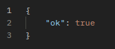

### Endpoints de consultas


